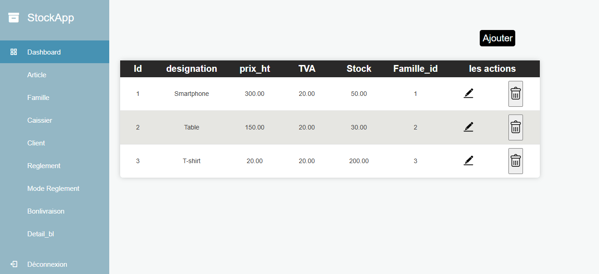
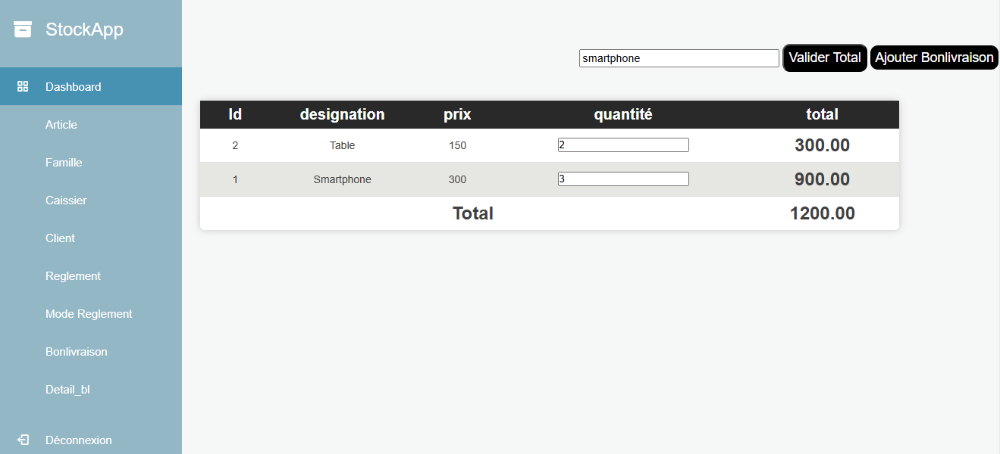

StockApp - Système de Gestion de Stock

StockApp est une application web complète développée en PHP/MySQL permettant de gérer efficacement l'inventaire, les catégories de produits et le suivi des mouvements de stock via des Bons de Livraison (BL).

 Fonctionnalités Clés
 Administration & Sécurité
- Authentification : Système de connexion sécurisé pour les administrateurs et les utilisateurs.
- Gestion des Utilisateurs : Module pour ajouter, modifier ou supprimer des profils (Caissiers/Gestionnaires).

 Gestion de l'Inventaire (CRUD)
- Articles : Gestion complète des produits (Ajout, Modification, Suppression, Affichage).
- Familles : Organisation des articles par catégories (Familles) pour un meilleur classement.
- Clients : Répertoire des clients pour le suivi des sorties de stock.

   Gestion Financière
- Règlements : Suivi des paiements effectués pour chaque commande ou livraison.
- Modes de Règlement : Gestion des différents types de paiement (Espèces, Chèque, Virement, etc.).

 Module de Transaction (Détail BL)
- Édition Dynamique : Création de Bons de Livraison avec ajout multiple d'articles sur une seule interface.
- Calculs en Temps Réel : Calcul automatique du total par ligne (Prix × Quantité) et du montant total global.
- Validation des Flux : Workflow de validation pour confirmer les sorties de stock et les règlements.

 Technologies Utilisées

- Backend : PHP (Procédural)
- Base de données : MySQL
- Frontend : HTML5, CSS3, JavaScript
- Bibliothèques : jQuery (pour les calculs dynamiques et l'interactivité), SweetAlert (pour les notifications).

Tableau de Bord et Gestion des Caissiers

 Module Détail Bon de Livraison (Logique de Calcul)

